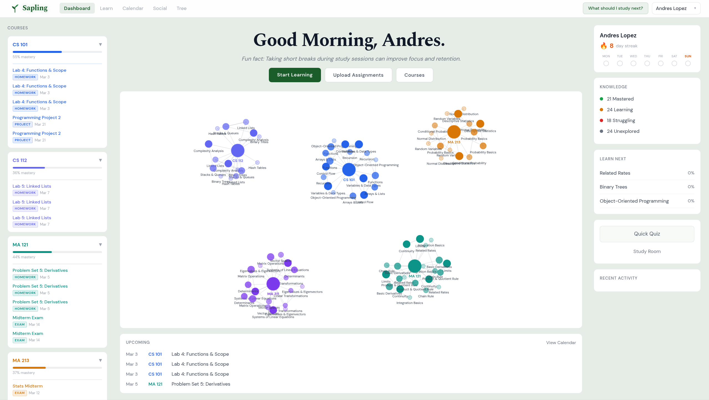

An AI-powered study companion that builds a live knowledge graph as you learn.




## Overview

Sapling is a study tool that adapts to how you learn. Chat with an AI tutor across three teaching modes, take adaptive quizzes, track assignments from your syllabus, and compare progress with classmates in study rooms. As you learn, a live knowledge graph maps your mastery in real time.

## Features

* **Live Knowledge Graph** — Your understanding is visualized as a growing node graph. Mastery scores update dynamically after every session and quiz.
* **Three Teaching Modes** — Socratic (guided reasoning), Expository (direct explanation), and TeachBack (you explain, Sapling corrects).
* **Adaptive Quizzes** — AI-generated quizzes targeting your weakest concepts, with difficulty scaling based on your performance.
* **Class Intelligence** — Aggregates anonymized class-wide patterns to surface common misconceptions and weak areas, personalizing your sessions.
* **Calendar & Syllabus Tracking** — Paste your syllabus and Sapling extracts assignments, deadlines, and topics automatically.
* **Study Rooms** — Invite classmates, compare knowledge graphs, and track relative mastery across your group.

## Tech Stack

* **Frontend** — Next.js (TypeScript) with D3.js for interactive graph visualization
* **Backend** — FastAPI (Python) serving a REST API with structured Gemini prompts
* **AI** — Google Gemini for tutoring, quiz generation, graph updates, and syllabus extraction
* **Database** — Supabase (PostgreSQL) for all persistent data

## Usage

**Backend**
```bash
cd backend
python3 -m venv venv
source venv/bin/activate   # fish: source venv/bin/activate.fish
pip install -r requirements.txt
cp .env.example .env       # fill in GEMINI_API_KEY, SUPABASE_URL, SUPABASE_SERVICE_KEY
python3 main.py            # → http://localhost:5000
```

**Frontend**
```bash
cd frontend
npm install
npm run dev                # → http://localhost:3000
```

## API Endpoints

- `POST` `/api/learn/start` — Start a tutoring session
- `POST` `/api/learn/chat` — Send a chat message
- `POST` `/api/quiz/generate` — Generate an adaptive quiz
- `GET`  `/api/graph/{user_id}` — Fetch the user's knowledge graph
- `POST` `/api/graph/update` — Update mastery scores from a session
- `GET`  `/api/calendar/{user_id}` — Fetch calendar events
- `POST` `/api/calendar/extract` — Extract assignments from a syllabus
- `GET`  `/api/social/rooms` — List study rooms
- `POST` `/api/social/rooms/join` — Join a study room by invite code

## Environment Variables

All variables live in `backend/.env`.

| Variable | Required | Description |
|---|---|---|
| `GEMINI_API_KEY` | ✅ | Google Gemini API key |
| `SUPABASE_URL` | ✅ | Your Supabase project URL |
| `SUPABASE_SERVICE_KEY` | ✅ | Supabase service role key |
| `PORT` | — | Backend port (default `5000`) |
| `FRONTEND_URL` | — | Allowed CORS origin (default `http://localhost:3000`) |
| `GOOGLE_CLIENT_ID` | — | For Google Calendar OAuth (optional) |
| `GOOGLE_CLIENT_SECRET` | — | For Google Calendar OAuth (optional) |

## License

Copyright (c) 2026 Andres Lopez, Jack He, Luke Cooper, and Jose Gael Cruz-Lopez
